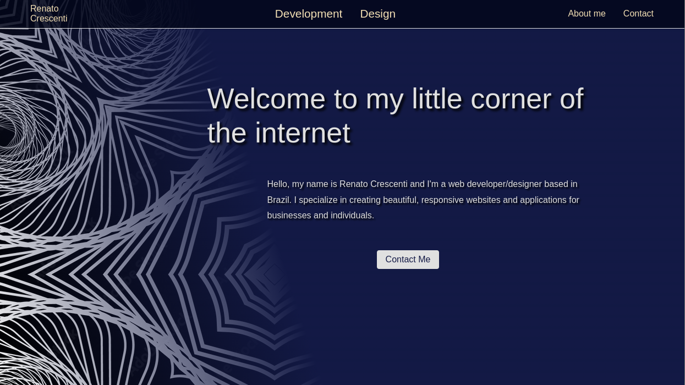
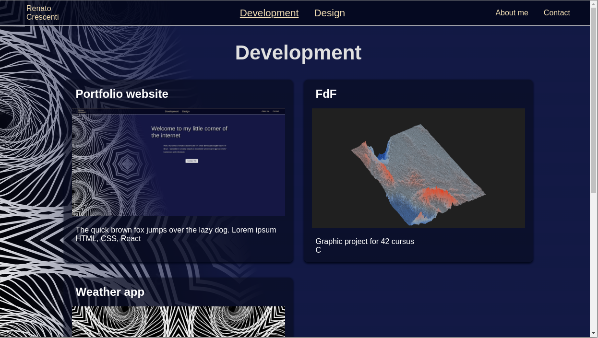
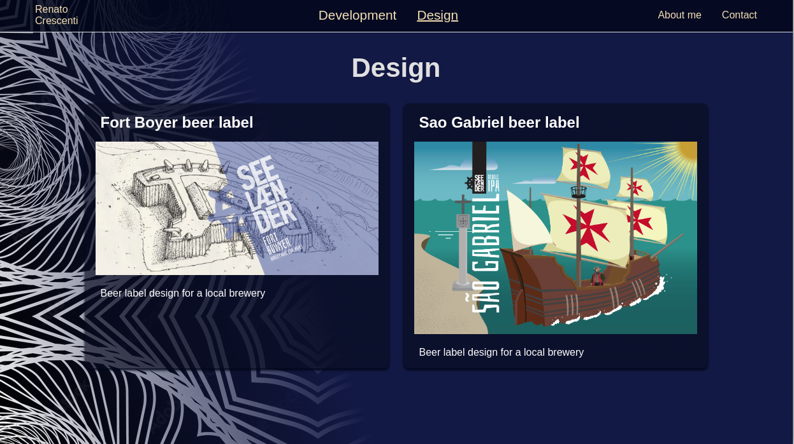
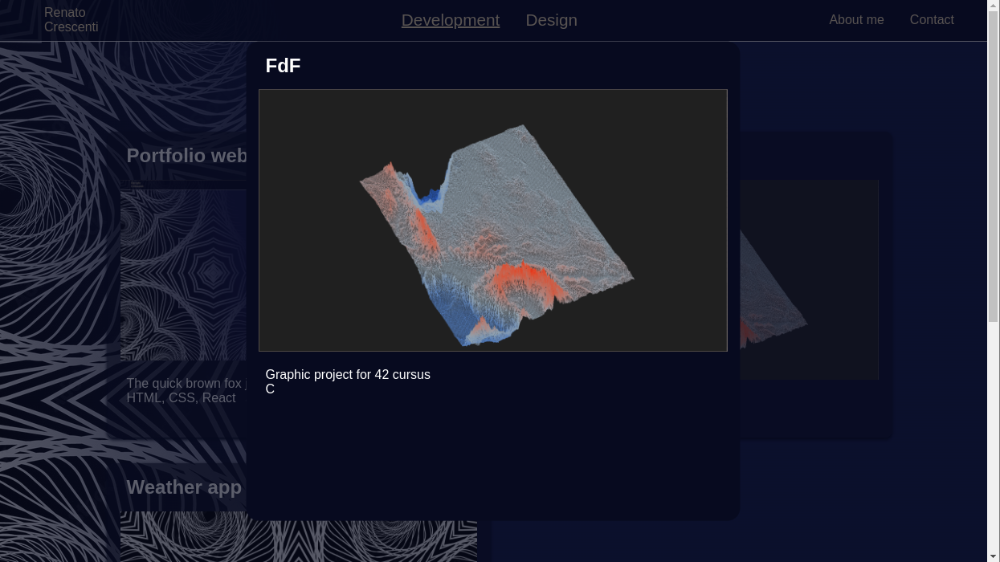
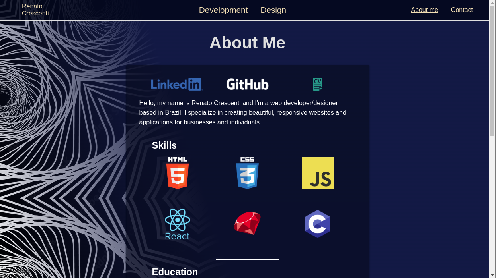
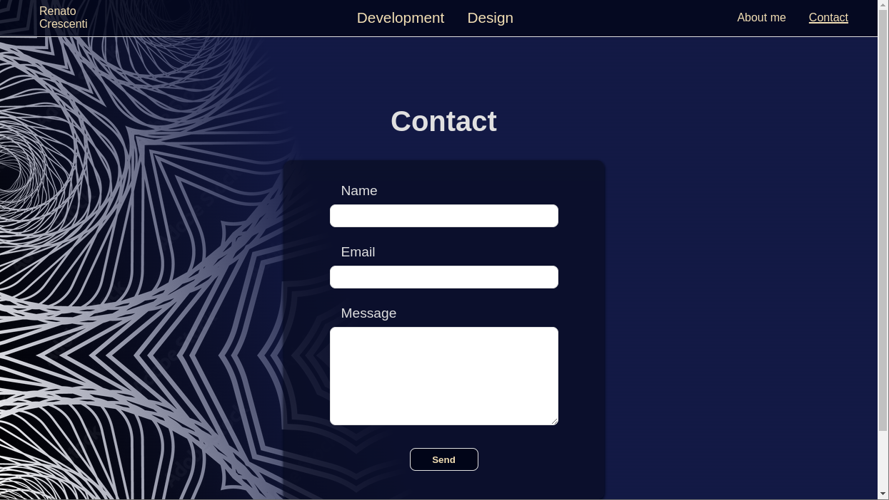

# My portfolio website

	
	
	
	

<!--  -->

I created this portfolio website as a personal project to learn ReactJS and ultimately have somewhere to showcase my projects.
It consists of a homepage, development and design portfolios, an About me page and a simple contact form.

## Home
Homepage
## Portfolios
### Development
Development portfolio
### Design
Design portfolio
### Modal
Project modal
## About me
About me
## Contact
Contact
